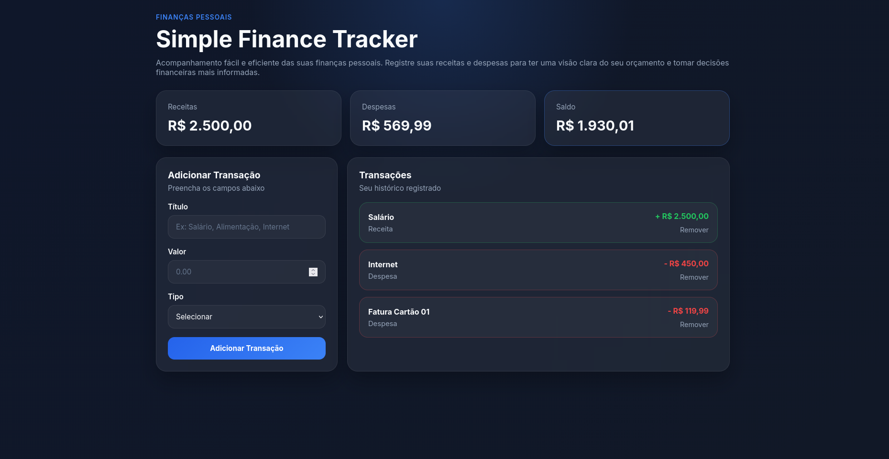
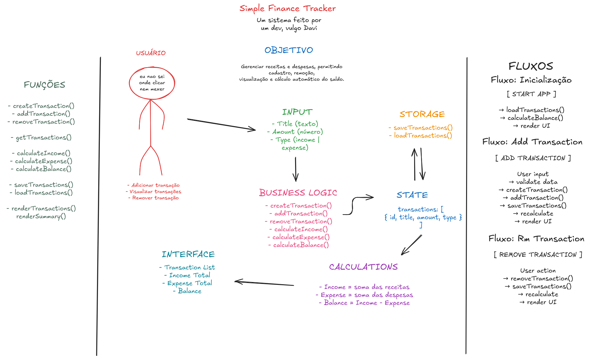

# 💸 Simple Finance Tracker

Um sistema simples e intuitivo para controle de finanças pessoais, permitindo registrar receitas e despesas com cálculo automático de saldo e persistência de dados.

---

## 📸 Preview



---

## 🧠 Arquitetura do Sistema



---

## 🚀 Como executar o projeto

Clone o repositório:

```bash id="o2v4fi"
git clone https://github.com/davi-amaraldev/simple-finance-tracker.git
cd simple-finance-tracker
```

Execute localmente:

```bash id="w9d7xk"
npx serve
```

Depois, abra a URL exibida no terminal.

---

## ✨ Funcionalidades

* Adicionar transações (receitas e despesas)
* Remover transações
* Cálculo automático do saldo
* Persistência de dados com localStorage
* Interface simples e responsiva

---

## 🏗️ Estrutura do Projeto

```id="9y2p4m"
js/
├─ app.js         # Fluxo principal da aplicação (controller)
├─ balance.js     # Cálculos financeiros
├─ storage.js     # Persistência com localStorage
├─ ui.js          # Manipulação do DOM (interface)
└─ transaction.js # Modelo de dados

css/
└─ style.css

index.html
```

---

## 🧠 Conceitos Aplicados

* Separação de responsabilidades (Separation of Concerns)
* Gerenciamento de estado (State Management)
* Delegação de eventos
* JavaScript modular (ES Modules)
* Funções puras
* Manipulação de DOM

---

## ⚙️ Como o sistema funciona

* O usuário insere uma transação (título, valor e tipo)
* A aplicação atualiza o estado interno
* Os dados são salvos no localStorage
* A interface é atualizada automaticamente
* O saldo é recalculado em tempo real

---

## 👨‍💻 Autor

Desenvolvido por **Davi Amaral**
GitHub: https://github.com/davi-amaraldev

---

## 📄 Licença

Este projeto está sob a licença MIT.
